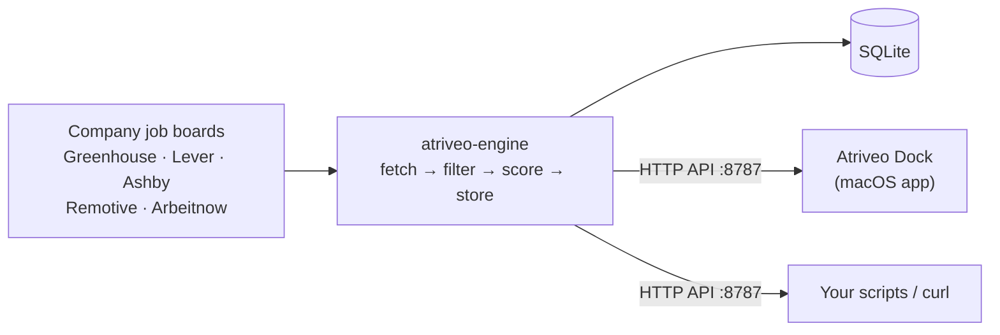

<div align="center">

# atriveo-engine

**A local job-search engine you run on your own machine. It collects fresh postings straight from company job boards, filters and scores them for you, and serves them over a small HTTP API.**


[](LICENSE)


[Roadmap](docs/ROADMAP.md) · [HTTP API](docs/API.md) · [Atriveo Dock](https://github.com/atishay-kasliwal/atriveo-job-dock)

</div>

---

> **Status:** in active development toward v0.1. The API contract and roadmap are fixed; the code is being built in the open. Watch or star the repo to follow along.

## Why

Job boards bury fresh postings under stale and irrelevant ones, and most aggregators either cost money or need an account. atriveo-engine runs on your own computer instead:

- **No account, no server, no keys.** It reads the public job-board APIs that companies publish themselves (Greenhouse, Lever, Ashby), plus remote-job boards.
- **Your filters, your scoring.** Roles, seniority, years of experience, locations, remote, and keywords you care about. Postings that rule out visa sponsorship are flagged, with an optional **H-1B sponsors only** mode.
- **Fresh by default.** Runs on demand or on a schedule, stores everything in one local SQLite file, and dedupes across sources and runs.
- **Plays well with others.** It speaks the same HTTP API as the Atriveo tailor sidecar, so **[Atriveo Dock](https://github.com/atishay-kasliwal/atriveo-job-dock)** can show its feed directly. It's also handy on its own from the command line or any script.

## Planned usage

```bash
# Run the engine (API on http://127.0.0.1:8787)
atriveo serve

# Collect jobs now
atriveo scrape

# Track another company by its careers page
atriveo companies add https://boards.greenhouse.io/examplecorp
```

Binaries for macOS, Linux, and Windows, plus `npx atriveo-engine`, will be on the [releases page](https://github.com/atishay-kasliwal/atriveo-engine/releases) at v0.1.

## How it fits together



## Sources and fair use

atriveo-engine only uses official public endpoints, follows each source's published terms (including attribution where asked), limits its request rate, and caches responses. It does not scrape LinkedIn or Indeed.

## Contributing

The [roadmap](docs/ROADMAP.md) lists what's being built. Issues and pull requests are welcome; please read the [API contract](docs/API.md) before changing anything the dock depends on.

## License

[MIT](LICENSE) © 2026 Atishay Kasliwal
