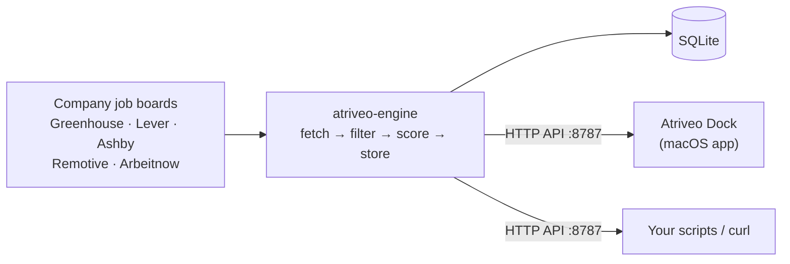

<div align="center">

# atriveo-engine

**A local job-search engine you run on your own machine. It collects fresh postings straight from company job boards, filters and scores them for you, and serves them over a small HTTP API.**


[](LICENSE)


[Roadmap](docs/ROADMAP.md) · [HTTP API](docs/API.md) · [Atriveo Dock](https://github.com/atishay-kasliwal/atriveo-job-dock)

</div>

---

> The engine core, HTTP API, and CLI are implemented. Release packaging is ready; tagged releases provide standalone binaries. Dock integration is the next phase.

## Why

Job boards bury fresh postings under stale and irrelevant ones, and most aggregators either cost money or need an account. atriveo-engine runs on your own computer instead:

- **No account, no server, no keys.** It reads the public job-board APIs that companies publish themselves (Greenhouse, Lever, Ashby), plus remote-job boards.
- **Your filters, your scoring.** Roles, seniority, years of experience, locations, remote, and keywords you care about. Postings that rule out visa sponsorship are flagged, with an optional **H-1B sponsors only** mode.
- **Fresh by default.** Runs on demand or on a schedule, stores everything in one local SQLite file, and dedupes across sources and runs.
- **Plays well with others.** It speaks the same HTTP API as the Atriveo tailor sidecar, so **[Atriveo Dock](https://github.com/atishay-kasliwal/atriveo-job-dock)** can show its feed directly. It's also handy on its own from the command line or any script.

## Quick start

```bash
# Run the engine (API on http://127.0.0.1:8787)
atriveo serve

# Collect jobs now
atriveo scrape

# Track another company by its careers page
atriveo companies add https://boards.greenhouse.io/examplecorp
```

Download a binary from the [releases page](https://github.com/atishay-kasliwal/atriveo-engine/releases): macOS universal (or arm64/x64), Linux x64/arm64, or Windows x64. On macOS/Linux, run `chmod +x atriveo-engine-*`, then invoke the downloaded file with the commands above. Mac binaries are ad-hoc signed, not notarized.

Once the npm package and matching release are published, Node 18+ users can run `npx atriveo-engine serve`. The launcher downloads the matching binary on first use, verifies its SHA-256 against the release manifest, and caches it. Bun is not required for this route.

From source:

```bash
bun install --frozen-lockfile
bun src/cli/index.ts scrape
bun src/cli/index.ts serve
```

A scrape prints the number of matching jobs and the top ten scores, titles, companies, locations, and application links. `scrape --json` returns the run state and today's jobs.

## Configuration and API access

Settings and SQLite data live in the directory printed by `atriveo config path`; `ATRIVEO_HOME` overrides it. The server creates a private token on first use. Use `atriveo token` to retrieve it and send it in the `X-Tailor-Token` header.

```bash
atriveo config set remote remote-only
atriveo config set sponsorsOnly true
atriveo config set locations '["New York", "Remote"]'
atriveo config set schedule.enabled true
atriveo config set schedule.intervalMinutes 60
atriveo config get
```

Scheduling is off by default. The API binds to loopback by default; see the [API contract](docs/API.md) for feeds, scrape control, and setup endpoints. Resume generation is not included in this engine.

## Build and release

`bun run build` builds all five architecture targets and, on macOS, combines and re-signs the universal binary. Pass targets to build a subset: `bun run build -- linux-x64`. Imported company and sponsor data are embedded, so binaries run outside the repository.

The Release workflow tests and builds artifacts on manual dispatch. A `v<package version>` tag also publishes the binaries and `SHA256SUMS` to GitHub Releases. Publish the npm package separately after its matching release exists (`npm publish`); the launcher uses that exact version.

## How it fits together



## Sources and fair use

atriveo-engine only uses official public endpoints, follows each source's published terms (including attribution where asked), limits its request rate, and caches responses. It does not scrape LinkedIn or Indeed. Remotive results keep their source links and are fetched at most once per six hours; Arbeitnow results retain attribution. Review [Remotive API terms](https://github.com/remotive-com/remote-jobs-api) and [Arbeitnow API documentation](https://www.arbeitnow.com/blog/job-board-api) before redistributing results.

## Contributing

The [roadmap](docs/ROADMAP.md) lists what's being built. Issues and pull requests are welcome; please read the [API contract](docs/API.md) before changing anything the dock depends on.

## License

[MIT](LICENSE) © 2026 Atishay Kasliwal
